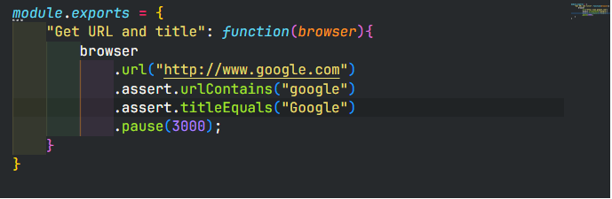
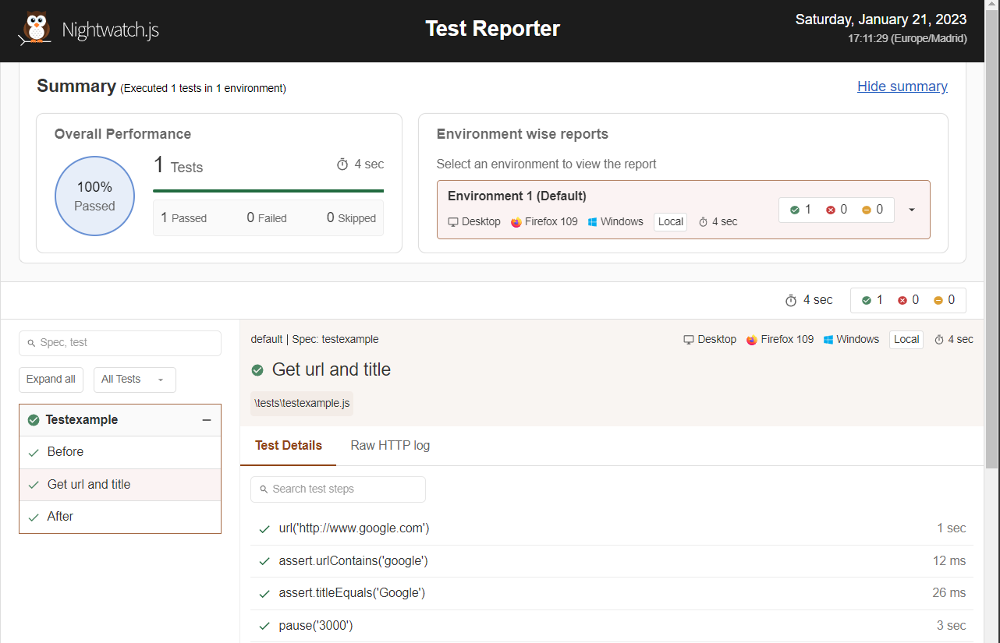

# My first nightwatch project

## Author: Juan Santos Poyato

### Description

This if my first project using nightwatch js with nodejs, npm and console in which I learn about the software use.

### Test

Here the test I've used as example. I do not use Gherkin to structure the test, since it is just to learn the use of nightwatchjs:

### Report

Here an example image of the report created with testexample:

